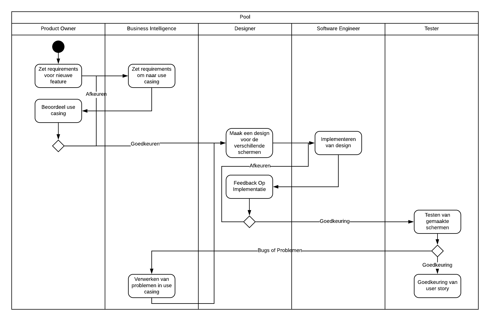

# Software wijzinging proces

Binnen dit document wordt er beschreven welke rollen er bij het ontwikkel proces
aanwezig zijn en welke taken er worden uitgevoerd.

## Rollen

Binnen dit hoofdstuk worden de verschillende rollen uitgelegd met daarbij een
uitleg wat de rol inhoud.

### Product Owner

Een externe partij waar de applicatie gewild is.
Deze groep geeft de eisen aan en beoordeeld de producten zowel tussendoor als bij
een release.

### Business Intelligence

Business Intelligence (BI) zorgt voor de business kant van de applicatie.
Er wordt overleg gepleegd met de klant en deze info wordt verfijnt zodat deze door
kunnen naar het engineering team.

### Designer

Om te zorgen dat de applicatie bruikbaar is en het juiste uiterlijk heeft is er
een designer.
Hierbij zou onderschijt gemaakt kunnen worden tussen een User Experience Designer
en een Frontend Designer.
Binnen de huidige status van het project is dit nog niet nodig.
Deze groep neemt de use casing van de BI groep en werkt deze om naar schermen.
assets of andere benodigdheden.

Deze output wordt doorgegeven binnen het engineering team.

### Software Engineer

Deze groep ontwikkeld de software en realiseert zowel de use casing vanuit de BI
en de schermen en andere eisen vanuit de designers.
Hier wordt er een onderschijt gemaakt tussen front- en back end engineers.
Dit betekend niet dat iemand niet allebij kan zijn.

### Tester

Een tester test de gemaakte software vanaf de Software Engineers.
Hierbij wordt er gekeken naar zowel fouten binnen het programmeren
(null checks, conversions, etc.) en fouten binnen de business kant
(voldoet de software aan de user story criteria).

### Configuratie Manager

Deze rol kijkt naar de dependencies die gebruikt worden binnen het project en
past deze aan waar nodig.
De Configuratie Manager is ook verantwoordelijk voor het opzetten van de Operations
hieronder valt onderandere de OTAP omgevingen en de buildstraat.
Aangezien de moderne wereld meer naar DevOps (een mix van software engineers en
configuration/operation managers) gaan ook bij dit project de Software Engineer
en Configuratie Manager rol overlap hebben.

## Verantwoordelijkheden

### Product Owner

De product owner is verantwoordelijk voor de requirements.
Er moeten requirements worden opgezet en beoordeeld worden of deze zijn behaald.

Dit is een niet technische rol en de requirements zijn strict functional en non-functional.
Technische eisen worden verder verwerkt door de BI.
De Product Owner is ook verantwoordelijk voor het goedkeuren van de user stories.

### Business Intelligence

BI werkt aan het opzetten van de use casing.
Hierbij wordt er aan het takenbord Features, Epics, Request For Change, Bugs of
User stories toegevoegd.

Deze worden uitgeschreven met edge casing en acceptatie criteria.
Binnen deze use casing mogen technische termen voorkomen aangezien dit bedoelt is
voor het engineering team.

### Designer

Designers maken de opzet van zowel de schermen als onderdelen die gemaakt gaan
worden door het frontend team.
Een designer kan ook assets maken of binnen halen (copyright free of inkoop).
Wanneer een ontwikkelaar een design keuze moet maken, moet een designer aanspreekbaar
zijn om deze keuze te ondersteunen.

### Software Engineer

Zorgt voor de ontwikkeling van de software, taken die hieronder vallen zijn:

- Ontwikkelen van de applicatie.
- Documenteren van de gemaakte code.
- Architectuur keuze onderbouwen.
- Documentatie over de opzet van de software onderhouden (domein model, architectuur diagram, etc.).
- Oplossen van bugs.

### Tester

Deze groep test de software en geeft eventueel gevonden bugs door aan het BI team.
Deze worden dan verwerkt als Bugs in het takenbord.

### Configuratie Manager

Een configuration manager brengt het hele plaatje in beeld en kijkt naar de gevaren
van de volledige applicatie.
Hierbij wordt de OTAP omgevingen opgezet door de Configuratie Manager en de
buildstraat wordt zowel opgezet als onderhouden.
Wanneer er een build breekt of de software kwaliteit niet hoog genoeg is, is dit niet aan de configuratie manager om dit op te lossen.

## Processen

### Ontwikkelproces

Binnen dit diagram wordt uitgelegd hoe een feature van concept naar uitwerking
wordt gebracht.
Dit gaat over een enkele feature, het oplevering proces wordt hier niet besproken.
Hierbij zijn er feedback loops aanwezig.
Dit zorgt ervoor dat al het gemaakte werk voldoet aan een standaard.
De bugs en problemen gaan terug naar BI om zo te zorgen dat de use casing
van kwaliteit blijft.

### Buildstraat aanpassen

Een aanpassing in de buildstraat wordt eerst gepresenteerd aan het engineering team.
Wanneer hier een positieve reactie uit komt, wordt de verandering toegepast.
Deze wordt met een `pull request` aan de stack.

### Server deployment

Een aanvraag voor een omgeving wordt op het projectbord voor
Configuratie Managers gezet.
Deze aanvraag wordt besproken en hierbij wordt een omgeving opgezet wanneer het
team er over eens is dat deze omgeving nodig is.

Wanneer deze aanvraag wordt afgekeurd, wordt dit met de reden en de alternatieve
oplossingen aangeleverd aan op de aanvrager.
